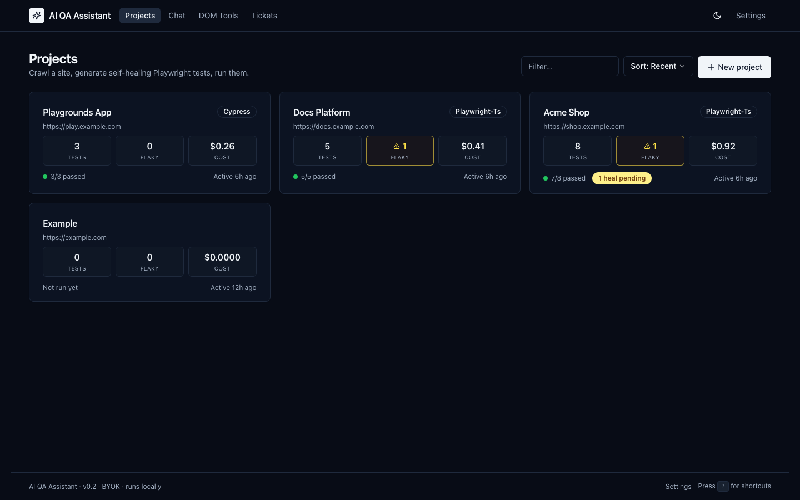
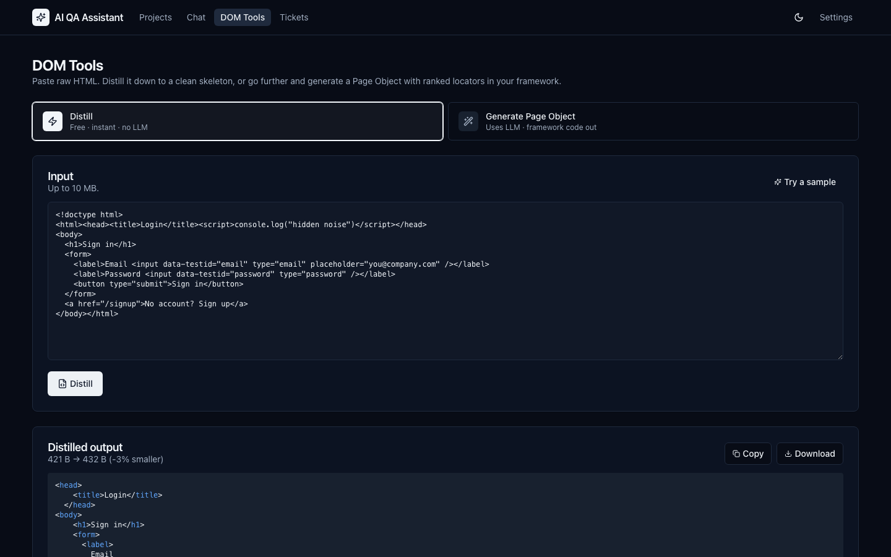
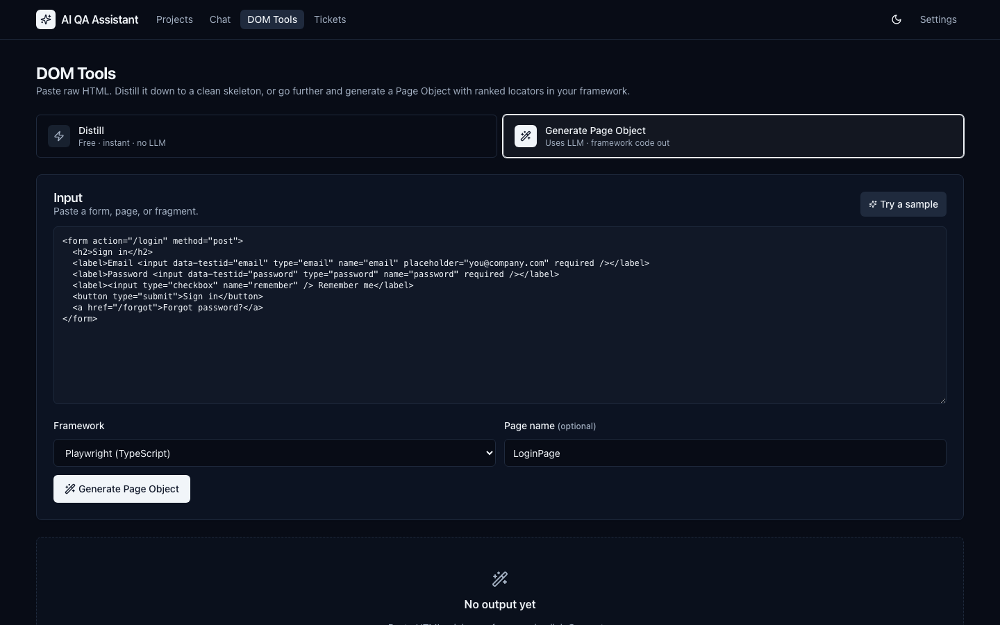
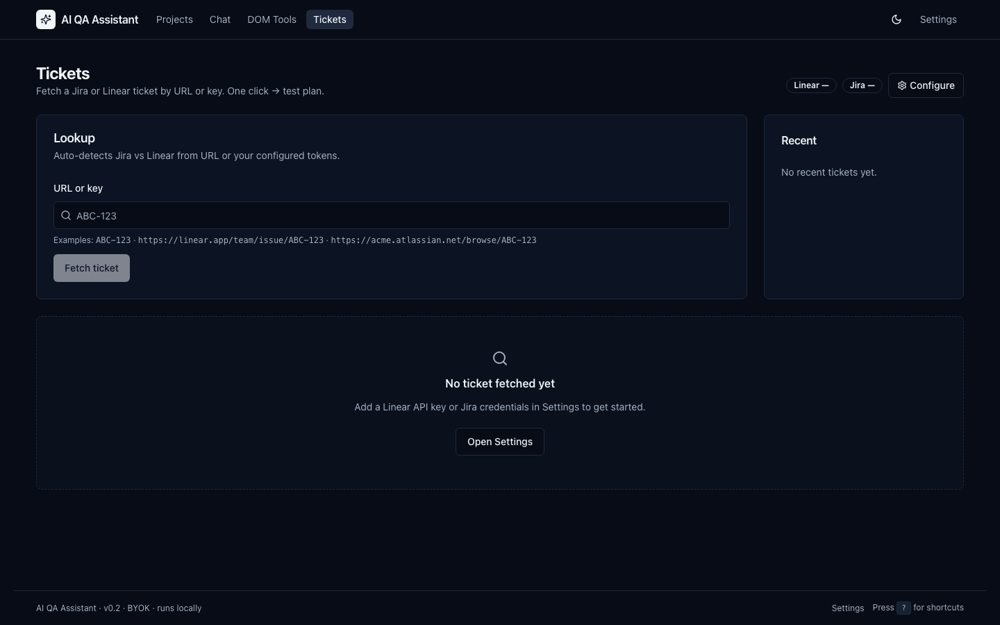
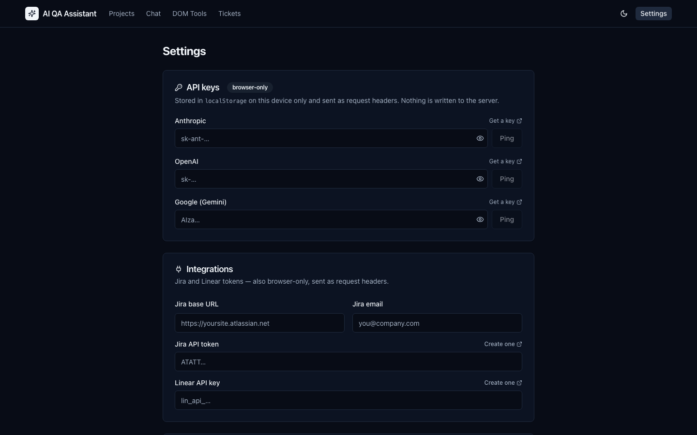

# TestPilot AI

A local Next.js QA copilot that crawls a site, distills the DOM, generates Playwright tests via LLMs, and **self-heals locators** when they break. Multi-provider (Claude / GPT / Gemini), BYOK, runs on your laptop.

## Highlights

- **Crawl → analyse → emit a runnable Playwright project**, not just code samples — output ships with `package.json`, page objects, locator metadata, and runs via `npx playwright test`.
- **Self-healing locators with a fast-path before the LLM**: ranked fallback candidates first; LLM proposal only if no fallback resolves; every proposal verified headlessly before it lands.
- **Cost-controlled LLM router**: budget cap, worst-case cost reservation before each call, atomic reconciliation to actuals, prompt caching on system blocks, tiered cheap/default models.
- **Multi-framework code-gen** beyond Playwright TS: Playwright Python, Cypress, WebdriverIO, Selenium Java/Python.
- **Sandboxed test execution**: spawned Playwright children get a whitelisted env, not the parent's secrets.
- **SSRF-safe crawler**, WAL-mode SQLite with integrity checks on cold start, Zod-validated LLM JSON with one auto-retry on parse failure.

## Screenshots

> Screenshots below use seeded demo data (`npx tsx scripts/seed-demo.ts`). Numbers are illustrative.

**Projects dashboard** — per-project test counts, flakiness flags, USD cost from `llm_calls`, last-run pass rate, pending-heal badges.



**DOM Tools — distill mode** — strips scripts/styles/hidden elements/noisy attributes, returns the meaningful HTML skeleton an LLM can analyse without hallucinating. No LLM call, instant.



**DOM Tools — generate page object** — paste HTML, pick a framework (Playwright TS/PY, Cypress, WebdriverIO, Selenium Java/PY), get a Page Object class with ranked locators.



**Tickets** — fetch a Jira or Linear ticket by URL or key and turn the description into a test plan.



**Settings (BYOK)** — provider keys and integration tokens live in the browser's `localStorage` only; sent as request headers and never persisted server-side.



## Run

```bash
npm install
npx playwright install chromium
npm run dev          # http://localhost:3000
npm test             # vitest unit + integration tests
```

## First-run

1. Open <http://localhost:3000/settings>, paste at least one provider API key.
2. **New project** → root URL.
3. **Discover** URLs → check the pages you care about → **Crawl**.
4. (Optional) **Build profile** to give the LLM site context.
5. (Optional) **Record auth** if the site needs login.
6. **Generate** tests — the runnable Playwright project lands in `data/projects/<slug>/`.
7. **Run all** to execute. Failed tests show a **Heal** button; proposals queue in `/heals` for review.

## Architecture

```
discover  →  capture (Playwright)  →  trim + hash
                                            ↓
profile builder  ────────┐           analyse (cheap LLM, cached)  →  page-object JSON
                         ↓                                                ↓
                    JSON profile  →  test plan (default LLM)         deterministic emit
                                                                          ↓
                                                                  Playwright project
                                                                          ↓
runner  →  JSON reporter  →  flakiness detector  →  failure?  →  healer  →  review
                                                                  ↓
                                          fast path: ranked fallback locators
                                          slow path: cheap LLM + headless verify
```

| Path | Purpose |
|---|---|
| `data/app.db` | SQLite — projects, pages, captures, tests, runs, heal_events, llm_calls, conversations, settings |
| `data/snapshots/<slug>/<page>/` | Per-page DOM, trimmed DOM, screenshot, network log, a11y |
| `data/projects/<slug>/` | The generated, runnable Playwright project |

## How it stays cheap

- **DOM trim**: scripts/styles/hidden stripped, repeat siblings collapsed (typical 70-90% size reduction).
- **Tiered models**: `cheap_model` for per-page analysis and heal; `default_model` only for the cross-page test plan.
- **Anthropic prompt caching** on system blocks (`cache_control: ephemeral`).
- **Hash dedupe** across captures so the same content isn't analysed twice.
- **URL-template dedupe** on discover so `/posts/1`, `/posts/2`, `/posts/abc-123` collapse to one representative.
- **Hard budget cap** (default $25). The LLM router refuses calls once `SUM(cost_usd) >= budget`. Worst-case cost is reserved *before* each call so a crash mid-flight can't underestimate spend; an orphan-sweep on startup clears reservations from prior crashes.

## Self-heal

- Heals **locator failures and locator-shaped timeouts** only. Assertion failures are never auto-healed.
- **Fast path**: try ranked fallback candidates from `locator_meta_json`. First one that resolves uniquely wins.
- **Slow path**: cheap LLM call with the current trimmed DOM + original element intent. The DOM is fenced as untrusted content so a page can't inject prompt instructions.
- **Verification**: every proposal is replayed headlessly; only proposals that match exactly one element are kept.
- **Review-gated**: proposals sit in `/heals` until you accept or reject. Nothing auto-applies.

## Keys & isolation (BYOK)

- Provider keys (Anthropic / OpenAI / Google) and integration tokens (Jira / Linear) live in the browser's `localStorage`.
- The frontend attaches them as request headers (`x-ai-provider-key-*`, `x-jira-*`, `x-linear-token`); the server reads them via `AsyncLocalStorage` per request and never persists them.
- Falling back to env vars (`ANTHROPIC_API_KEY` etc.) is supported for CLI / scripted use — see `.env.local.example`.
- **Spawned Playwright children get a whitelisted env** (`PATH`, `HOME`, `BASE_URL`, `STORAGE_STATE`, etc.) — they don't inherit your provider keys or other parent-process secrets.

## What works well

- DOM distillation, locator ranking, multi-framework code emission, fast-path heals — these are deterministic and well-covered by `tests/`.
- The emit→run integration test (`tests/emit-runnable.test.ts`) actually executes Playwright against a synthetic local fixture and asserts the suite passes.
- Cost tracking + budget enforcement is conservative by design: it over-reserves rather than under-counts.

## What's hard / known limitations

These are real and intentional rather than missing:

1. **Heal proposals aren't re-validated under timing variance.** The headless verification runs once against the page's current state. If the failing test would have race-condition with a modal or A/B variant, the heal can bind to the "wrong-but-currently-unique" element. A second-pass re-verify (or tracking heal regression rate) would close this — left as a TODO because the right policy depends on data we don't have yet.
2. **Synthetic LLM responses are not used in tests.** The unit suite covers parsing, prompts, and locator logic at the function level. There's no recorded-fixture replay against the real LLM APIs, so prompt or schema drift only surfaces in real use. Worth adding once you've used it enough to have representative fixtures.
3. **Single-tenant / no UI auth.** The app is designed to run on `127.0.0.1`. There's no project-ownership check; do not expose this server to a network.
4. **Flakiness heuristic is naive.** Coefficient-of-variation > 0.5 over the last 20 runs flags "flaky." A handful of slow first runs can stick. Per-test override and pass-rate trend separation would be a real improvement.
5. **Crawler discovers one level deep.** It harvests `<a href>` from the root and the sitemap, then dedupes by URL template. It doesn't recurse. For SPAs that hide routes behind interaction, you'll need to seed the URL list manually.
6. **SQLite + WAL fits a single user.** For multi-user or higher concurrency you'd want Postgres; the schema is portable but the migration runner is SQLite-specific.

## Tests

```bash
npm test              # unit + integration (vitest)
npm run lint
npx tsc --noEmit      # typecheck
```

13 test files, 58 tests. The integration test spawns a real `chromium.launch()` against a local fixture and runs the emitted Playwright project end-to-end.

## Production caveats

- Single-tenant, runs locally — no auth on the UI.
- Don't expose this server to the network: it has no rate limiting and no auth.
- Generated projects pin Playwright. Bump the dependency in the generated `package.json` periodically.
- The SQLite database in `data/app.db` is the entire history of your work. Back up `data/` if you care about it.

## Stack

Next.js 14 (App Router) · TypeScript · Tailwind + Radix · better-sqlite3 · Playwright · Anthropic / OpenAI / Gemini SDKs · Zod · Pino · linkedom · Vitest.
